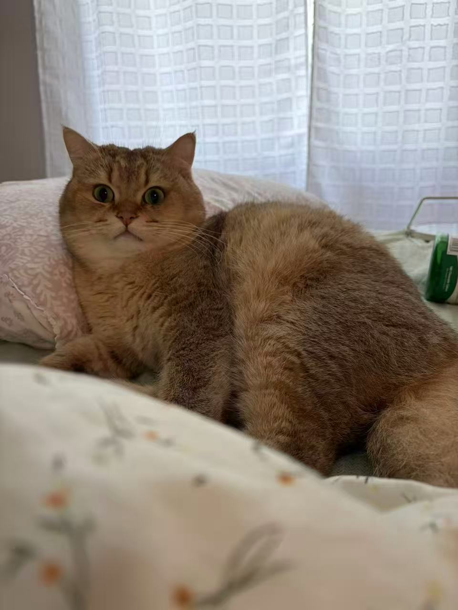
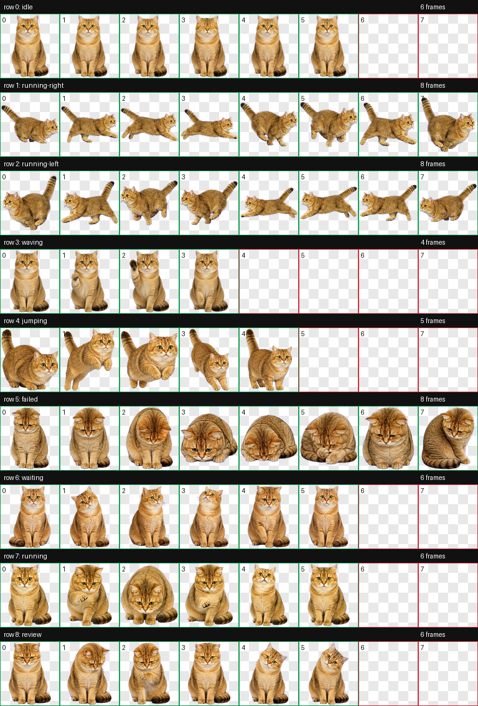

# Hatch Real Pet

用真实参考照片生成 Codex 兼容的真实风格 pet。不是像素风。

[English README](README.md)

这个 repo 包含：

- `skills/hatch-real-pet/`：Codex skill 本体。
- `pets/jinbao/`：可以直接导入 Codex 的 Jinbao demo pet。
- `data/jinbao/`：Jinbao 的原图、生成过程文件和 QA 文件，方便学习和传播。





## 安装 Skill

在 repo 根目录运行：

```bash
mkdir -p "${CODEX_HOME:-$HOME/.codex}/skills"
cp -R skills/hatch-real-pet "${CODEX_HOME:-$HOME/.codex}/skills/"
```

重启 Codex，或者开一个新的 Codex session。之后就可以用 `$hatch-real-pet`。

## 生成自己的 Pet

准备一张或多张清晰的宠物照片，然后对 Codex 说：

```text
Use $hatch-real-pet to create a realistic Codex pet named Mochi from:
/absolute/path/to/mochi-front.jpg
/absolute/path/to/mochi-side.jpg

Keep the real markings, face, body shape, fur texture, and collar placement.
Package it under my Codex custom pets folder.
```

生成完成后，pet 会写到：

```text
${CODEX_HOME:-$HOME/.codex}/pets/<pet-name>/
  pet.json
  spritesheet.webp
```

## 直接导入 Jinbao 测试

在 repo 根目录运行：

```bash
mkdir -p "${CODEX_HOME:-$HOME/.codex}/pets"
cp -R pets/jinbao "${CODEX_HOME:-$HOME/.codex}/pets/"
```

然后重启 Codex，或者刷新 custom pets。`pets/jinbao/` 里面已经是 Codex 需要的最终结构：

```text
pet.json
spritesheet.webp
```

## Skill 做了什么

`$hatch-real-pet` 用 `$imagegen` 生成视觉素材，再用确定性的脚本打包：

1. 根据参考照片生成真实风格的 pet 基础图。
2. 生成 idle、running、jumping、waiting、review、failed 等动画行。
3. 校验 `1536x1872` 的 spritesheet atlas，每个 cell 是 `192x208`。
4. 生成 QA 图和预览视频。
5. 写出 `pet.json` 和 `spritesheet.webp`。

## Demo 文件说明

- `pets/jinbao/`：最简单的直接导入目录。
- `data/jinbao/original/reference-01.jpg`：一张 Jinbao 原图。
- `data/jinbao/run/qa/contact-sheet.png`：最直观的 QA 总览图。
- `data/jinbao/run/qa/videos/`：每个动作状态的预览视频。
- `data/jinbao/run/prompts/`：demo 生成时用到的 prompts。
- `data/jinbao/run/final/spritesheet.webp`：最终 atlas。

Jinbao 生成时用过更多私人参考图。这个 repo 只放了一张原图，以及生成后的 demo 文件。
